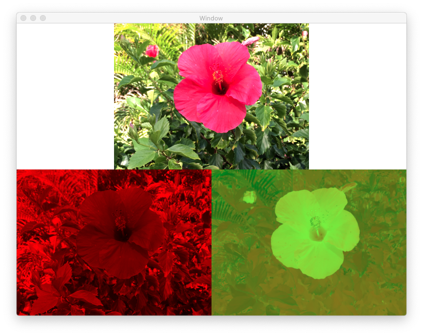

## Convert an image From RGB  color space to YpCbCr color space

### Overview
This demo is an alternative to the demo **RGB2LumaChroma**. Whereas, the latter program uses a Metal Kernel function to convert RGB formatted images to YpCbCr images, the conversion process is carried out by the the CPU using the functions of the *vImage* module which is part of the *Accelerate* framework. *CoreGraphics* and *CVPixelBuffer* functions are called during the conversion process.

### Details
A major part of the action takes place in the function **buildResources**.

The input RGBA graphic is loaded and an instance of *CGImage* created. Calling the function **cvPixelBufferFromImage** will create a blank *CVPixelBuffer* object. Next, the function sets up a call to create a Quartz 2D context using the CoreGraphics initializer:

    init?(data:width:height:bitsPerComponent:bytesPerRow:space:bitmapInfo:)

Drawing into this context will convert the interleaved RGBA pixels of the *CGImage* object (passed as a parameter to the function:

	draw(_:in:byTiling:)) 

into interleaved ARGB pixels. On return from the draw function, the memory of the **CVPixelBuffer** object will be populated with ARGB pixels.

A biplanar *CVPixelBuffer* object is then created by calling the function **CVPixelBufferCreate**. Next, using the ARGB *CVPixelBuffer* object as source, a call to a custom function **convertARGBToNV12** will populate the planes of the destination *CVPixelBuffer* object with yCbCr pixels. The first plane of this *CVPixelBuffer* object encapsulates the luminance channel while the second plane, the two chrominance channels.

Finally, two instances of *MTLTextures* are created from the contents of the biplanar CVPixelBuffer object by calling the function **texturesFromPixelBuffer**.

These two textures are then passed to a kernel function as inputs. The kernel function outputs an RGB texture.

A call to the function **createRGBTexture** will convert the two MTLTextures back to an RGBA texture.

Since the rendering of the images is Metal-based, all textures are instances of the class *MTLTexture*.

***Expected Output:**

Top middle: Reconstituted RGB texture, Bottom left: luminance texture, Bottom right: chrominance texture

This demo allows both the *lumaTexture* and *chromaTexture* to be saved to an external storage device. Their names are hard-coded and can be modified by editing the source file *ViewController.swift*.

**Web-links:**

https://dev.to/petertech/reducing-jpeg-uiimage-ram-usage-by-50-2jed
